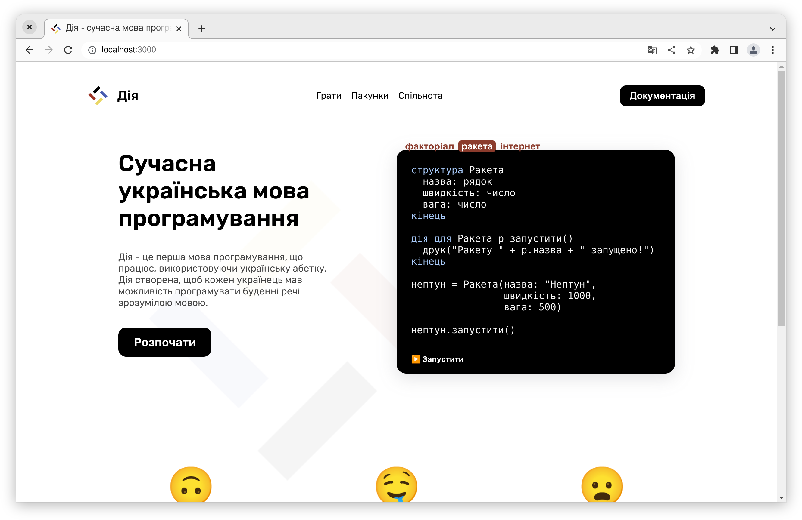

# мавка.укр

Основний вебсайт Мавки.



## Setup

Make sure to install the dependencies:

```bash
npm install
```

## Development Server

Start the development server on http://localhost:3000

```bash
npm run dev
```

## Production

Build the application for production:

```bash
npm run build
# or
npm run generate
```

Locally preview production build:

```bash
npm run preview
```
